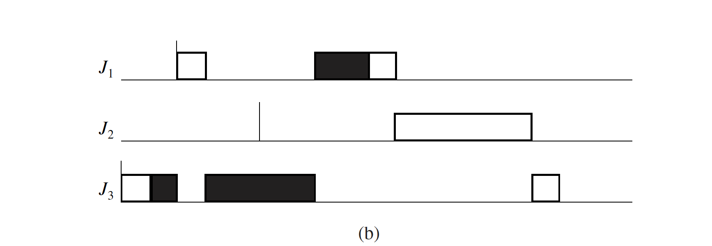

# Real Time Systems (Assignment-2):

### Q1
> Create the two tasks in FreeRTOS. The first task should occupy the processor for a long time – you can create a task with a very long delay in the task code. Generally, this can be considered as a computation task (such as a large matrix multiplication task) on an embedded system, which occupies the processor for most of the time. There is another task which is a communication task, which needs to send data every time a certain number of computations/time duration elapses (say 100 computations). Implement triggering of communication task from the computation task *(Hint: Use Notifications).*


#### Solution Approach

- Enable notifications by setting 'configUSE_TASK_NOTIFICATIONS' to 1 in FreeRTOSConfig.h
- Create two static tasks (T1 & T2) with IDLE priorities
- T1 will be the computation task which has a long computation workload
- T2 is a communication task which has a smaller work load.
- Both the task will be started in the scheduler
- After a fixed number of computational units of T1, T1 will notify T2 to execute and will wait for a notification from T2.
- T2 will be waiting for the notification from T1. Once received, it will execute and notify back to T1 after completion and wait.
- T1 will again execute for another fixed number of computational units and notify T2 and wait.
- T2 will again execute once it receives the notification from T1 and after completion notify back and wait.
... and so on ...
- Once T1 reaches it total computational units the execution halts


#### Compilation Run
```
FreeRTOSPosix$ make clean; make
--------------
CLEAN COMPLETE
--------------
>> Compiling croutine.c
>> Compiling event_groups.c
>> Compiling list.c
>> Compiling queue.c
>> Compiling tasks.c
>> Compiling timers.c
>> Compiling heap_3.c
>> Compiling port.c
>> Compiling main.c
>> Linking FreeRTOSPosix...
-------------------------
BUILD COMPLETE: FreeRTOSPosix
-------------------------
FreeRTOSPosix$
```


#### Execution Run
```
FreeRTOSPosix$ ./FreeRTOSPosix

Workflow Summary:
-----------------
- Computation   Task: 5000 Units
- Communication Task:  200 Units
- For every 1000 units of Computation work Communication task is executed
-----------------
Running as PID: 79062
Timer Resolution for Run TimeStats is 100 ticks per second.
[COMPUTATION]   Completed = 1000 : Remaining = 4000
[COMMUNICATION] Sending Data ...
[COMMUNICATION] Data Sent !!!
[COMPUTATION]   Completed = 2000 : Remaining = 3000
[COMMUNICATION] Sending Data ...
[COMMUNICATION] Data Sent !!!
[COMPUTATION]   Completed = 3000 : Remaining = 2000
[COMMUNICATION] Sending Data ...
[COMMUNICATION] Data Sent !!!
[COMPUTATION]   Completed = 4000 : Remaining = 1000
[COMMUNICATION] Sending Data ...
[COMMUNICATION] Data Sent !!!
[COMPUTATION]   Completed = 5000 : Remaining = 0
[COMMUNICATION] Sending Data ...
[COMMUNICATION] Data Sent !!!
[COMPUTATION]   All Computations completed !!!
^C
FreeRTOSPosix$
```


# Q2
>There are 3 tasks with priorities and execution times as shown in the figure below. Please implement the priority inheritance protocol. *(Hint: Use Notifications and Priority Changes).*


<p align="center">
  
</p>
